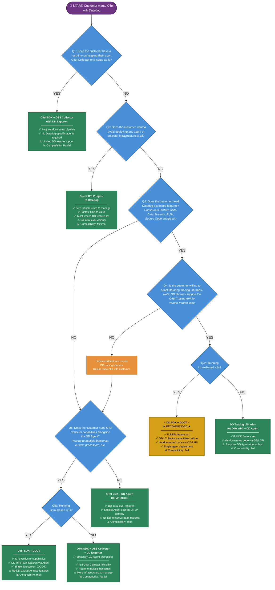

# OTel Setup Decision Flowchart

Use this flowchart to determine which OpenTelemetry setup type best fits a customer's requirements and constraints.

## Setup Types Summary

| Setup Type | When to Use |
|---|---|
| **DD SDK + DDOT** ⭐ | Customer on Linux K8s, wants full DD features + OTel Collector capabilities. **Recommended path.** |
| **DD Tracing Libraries + DD Agent** | Customer wants full DD features but isn't on Linux K8s. |
| **OTel SDK + DDOT** | Customer on Linux K8s, needs Collector capabilities, doesn't need DD-exclusive trace features. |
| **OTel SDK + OSS Collector + DD Exporter** | Customer committed to vendor-neutral Collector pipeline, or not on K8s but needs Collector features. |
| **OTel SDK + DD Agent (OTLP Ingest)** | Customer wants DD infra features with a simple OTLP setup, no Collector needs. |
| **Direct OTLP Ingest** | Customer wants zero infrastructure; accepts limited feature set. |

## Feature Compatibility Matrix

Based on the [Datadog OTel Feature Compatibility](https://docs.datadoghq.com/opentelemetry/compatibility/#feature-compatibility) documentation.

| Feature | DD SDK + DDOT | OTel SDK + DDOT | OTel SDK + OSS Collector | Direct OTLP |
|---|:---:|:---:|:---:|:---:|
| Distributed Tracing | Y | Y | Y | Y |
| Correlated Traces/Metrics/Logs | Y | Y | Y | Y |
| LLM Observability | Y | Y | Y | Y |
| Runtime Metrics | Y | Partial | Partial | Partial |
| Infrastructure Host List | Y | Y | Y | - |
| DB Monitoring | Y | Y | - | - |
| Cloud Network Monitoring | Y | Y | - | - |
| Live Containers / K8s | Y | Y | - | - |
| Live Processes | Y | Y | - | - |
| USM | Y | Y | - | - |
| App & API Protection | Y | - | - | - |
| Continuous Profiler | Y | - | - | - |
| Data Streams Monitoring | Y | - | - | - |
| RUM | Y | - | - | - |
| Source Code Integration | Y | - | - | - |

### Reading the Matrix

- **Y** = Fully supported
- **Partial** = Limited or partial support
- **-** = Not available with this setup type

### Key Takeaways

1. **DD SDK + DDOT** is the only setup that provides the complete Datadog feature set while also offering OTel Collector capabilities.
2. **DD-exclusive features** (ASM, Profiler, DSM, RUM, Source Code Integration) require Datadog tracing libraries — they are not available with OTel SDK alone.
3. **Infrastructure-level features** (DB Monitoring, CNM, Live Containers, USM) require a Datadog Agent (either standalone or as DDOT) and are not available via OSS Collector or direct ingest.
4. **Core observability** (traces, correlated signals, LLM Obs) works across all setup types.
